# Architecture Technique - Infrastructure Azure

## 🏗️ Vue d'ensemble de l'architecture

Cette infrastructure Azure déploie une solution web simple mais sécurisée, adaptée pour un environnement de développement ou de test. L'architecture suit les bonnes pratiques de sécurité et de performance.

## 📐 Schémas d'architecture

### Schéma généré automatiquement par Azure
*Diagramme officiel généré par Azure Portal montrant toutes les connexions et dépendances*
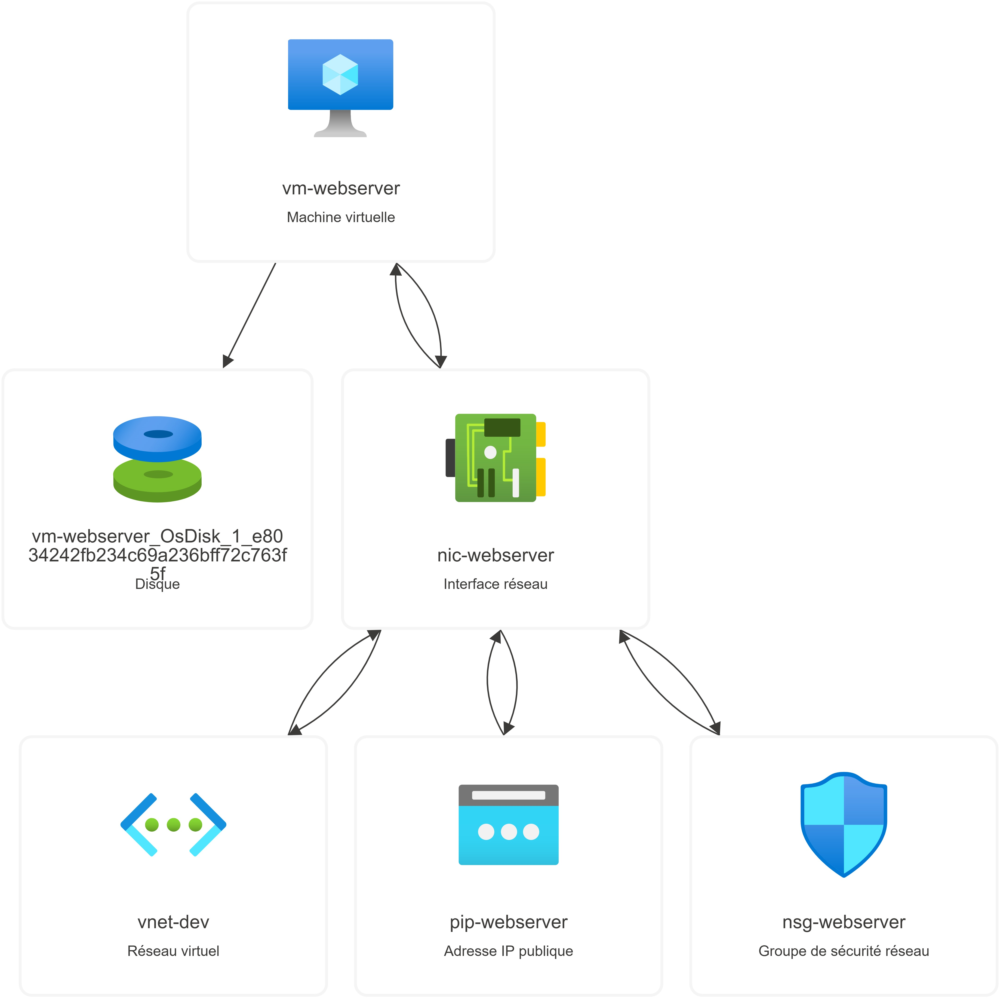

### Schéma conceptuel détaillé

```
Internet
    │
    │ HTTPS/HTTP (Port 80/443)
    │ SSH (Port 22 - IP restreinte)
    │
    ▼
┌─────────────────────────────────────────────────────────────┐
│                    AZURE SUBSCRIPTION                      │
│                                                             │
│  ┌─────────────────────────────────────────────────────────┐│
│  │             RESOURCE GROUP                              ││
│  │            rg-terraform-dev                             ││
│  │          (France Central)                               ││
│  │                                                         ││
│  │  ┌─────────────────────────────────────────────────────┐││
│  │  │               NETWORKING                            │││
│  │  │                                                     │││
│  │  │  ┌───────────────────────────────────────────────┐  │││
│  │  │  │          VIRTUAL NETWORK                      │  │││
│  │  │  │           vnet-dev                            │  │││
│  │  │  │        (10.0.0.0/16)                         │  │││
│  │  │  │                                               │  │││
│  │  │  │  ┌─────────────────────────────────────────┐  │  │││
│  │  │  │  │            SUBNET PUBLIC                │  │  │││
│  │  │  │  │         subnet-public                   │  │  │││
│  │  │  │  │        (10.0.1.0/24)                   │  │  │││
│  │  │  │  │                                         │  │  │││
│  │  │  │  │  ┌─────────────┐  ┌─────────────┐      │  │  │││
│  │  │  │  │  │PUBLIC IP    │  │     NSG     │      │  │  │││
│  │  │  │  │  │pip-webserver│  │nsg-webserver│      │  │  │││
│  │  │  │  │  │   Static    │  │   Rules:    │      │  │  │││
│  │  │  │  │  │Standard SKU │  │ SSH:22 ✓    │      │  │  │││
│  │  │  │  │  └─────────────┘  │ HTTP:80 ✓   │      │  │  │││
│  │  │  │  │         │         │ HTTPS:443 ✓ │      │  │  │││
│  │  │  │  │         │         └─────────────┘      │  │  │││
│  │  │  │  │         │                │            │  │  │││
│  │  │  │  │         ▼                ▼            │  │  │││
│  │  │  │  │  ┌─────────────────────────────────┐  │  │  │││
│  │  │  │  │  │       NETWORK INTERFACE         │  │  │  │││
│  │  │  │  │  │        nic-webserver            │  │  │  │││
│  │  │  │  │  │    Private IP: Dynamic          │  │  │  │││
│  │  │  │  │  │    Public IP: Attached          │  │  │  │││
│  │  │  │  │  └─────────────────────────────────┘  │  │  │││
│  │  │  │  │                 │                     │  │  │││
│  │  │  │  └─────────────────┼─────────────────────┘  │  │││
│  │  │  └──────────────────────┼──────────────────────────┘  │││
│  │  └─────────────────────────┼─────────────────────────────┘││
│  │                          │                              ││
│  │  ┌─────────────────────────┼─────────────────────────────┐││
│  │  │                COMPUTE  │                             │││
│  │  │                        │                             │││
│  │  │        ┌───────────────▼───────────────┐              │││
│  │  │        │        VIRTUAL MACHINE       │              │││
│  │  │        │         vm-webserver         │              │││
│  │  │        │                              │              │││
│  │  │        │  OS: Ubuntu 22.04 LTS        │              │││
│  │  │        │  Size: Standard_B1s          │              │││
│  │  │        │  CPU: 1 vCPU                 │              │││
│  │  │        │  RAM: 1 GB                   │              │││
│  │  │        │  Disk: 30 GB StandardSSD_LRS │              │││
│  │  │        │                              │              │││
│  │  │        │  Services:                   │              │││
│  │  │        │  ├─ SSH Server (Port 22)     │              │││
│  │  │        │  ├─ Nginx Web Server (80)    │              │││
│  │  │        │  └─ Custom Web Page          │              │││
│  │  │        │                              │              │││
│  │  │        │  Authentication:             │              │││
│  │  │        │  └─ SSH Key Only (No PWD)    │              │││
│  │  │        └──────────────────────────────┘              │││
│  │  └─────────────────────────────────────────────────────┘││
│  └─────────────────────────────────────────────────────────┘│
└─────────────────────────────────────────────────────────────┘
```

## 🔧 Composants techniques détaillés

### 1. **Resource Group**
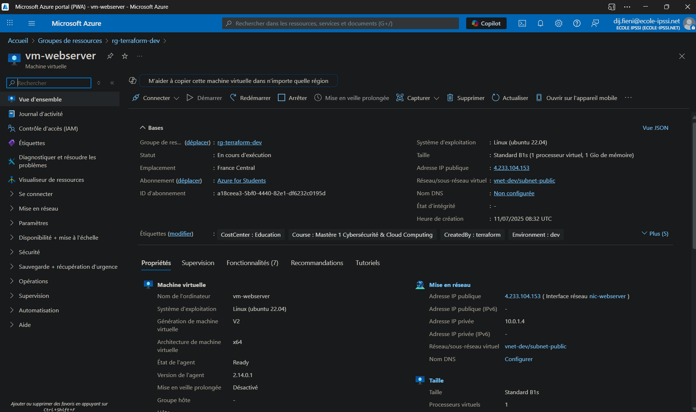
*Vue du Resource Group avec toutes les ressources déployées*

- **Nom**: `rg-terraform-dev`
- **Région**: France Central
- **Objectif**: Conteneur logique pour toutes les ressources
- **Cycle de vie**: Géré par Terraform

### 2. **Réseau virtuel (VNet)**
- **Nom**: `vnet-dev`
- **Espace d'adressage**: 10.0.0.0/16 (65,536 adresses IP)
- **Subnets**:
  - `subnet-public`: 10.0.1.0/24 (256 adresses IP)
- **DNS**: Azure DNS par défaut

### 3. **Sécurité réseau**
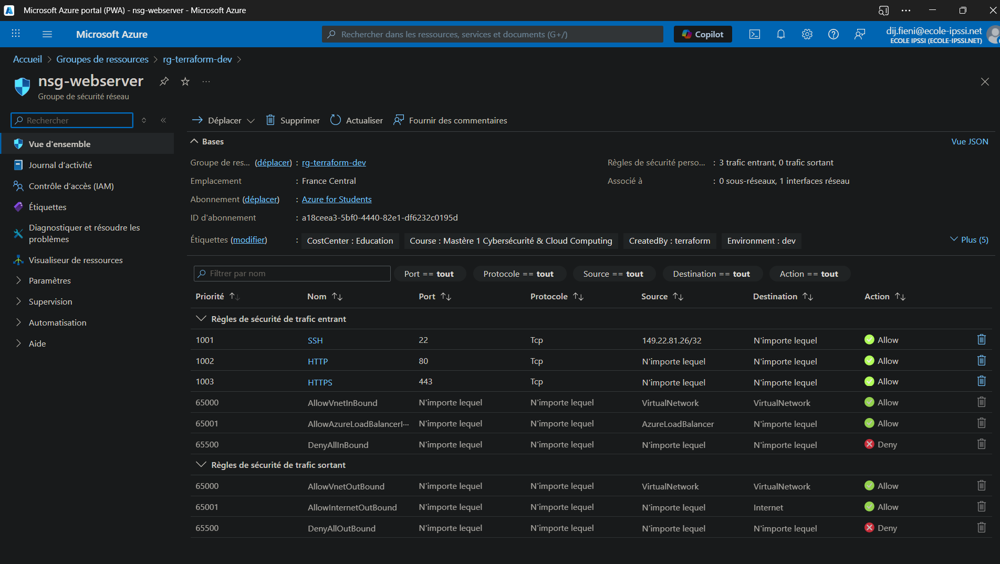
*Règles du Network Security Group configurées*

- **Network Security Group**: `nsg-webserver`
- **Règles configurées**:
  ```
  Priorité 1001: SSH (TCP/22) - Source: IP spécifique
  Priorité 1002: HTTP (TCP/80) - Source: Internet
  Priorité 1003: HTTPS (TCP/443) - Source: Internet
  ```
- **Politique par défaut**: Deny All (sécurité par défaut)

### 4. **Adressage IP**
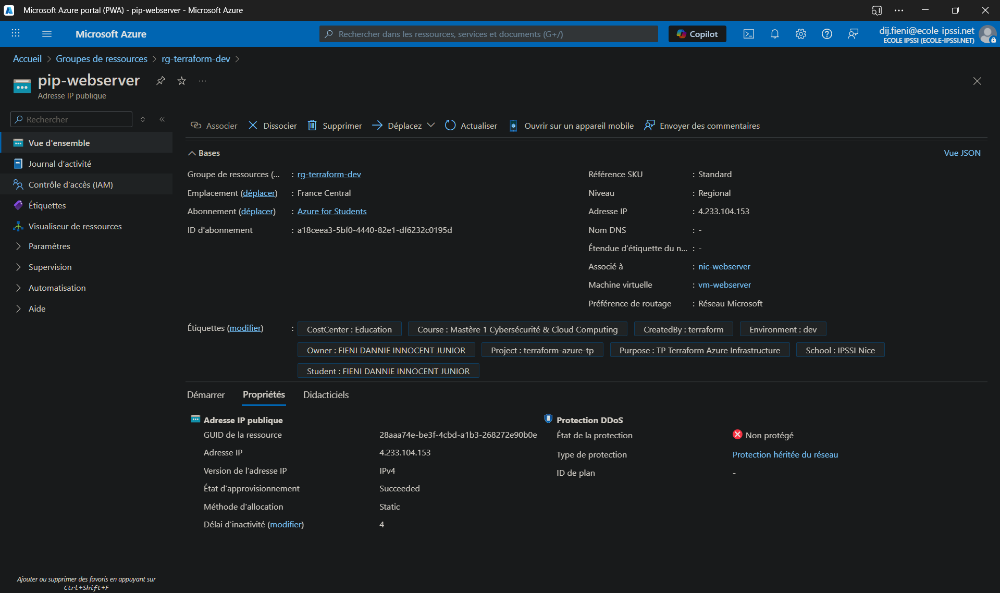
*Détails de l'IP publique statique*

- **IP publique**: `pip-webserver`
- **Type**: Static
- **SKU**: Standard (requis pour les zones de disponibilité)
- **IP privée**: Attribution dynamique via DHCP Azure

### 5. **Machine virtuelle**
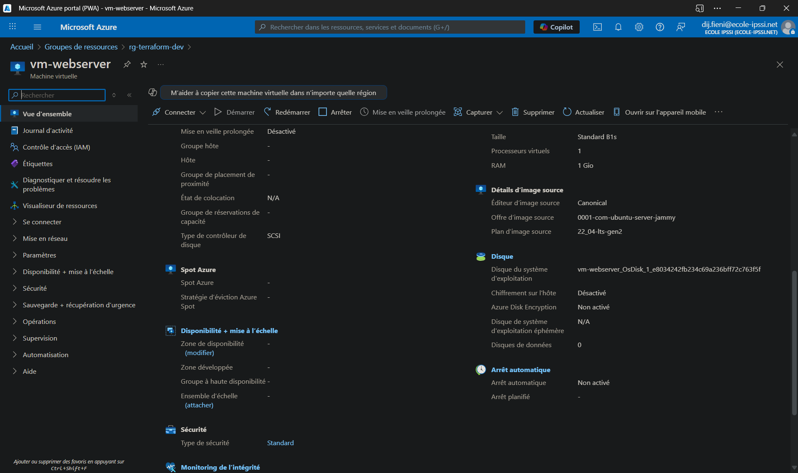
*Vue d'ensemble de la machine virtuelle*


*Configuration réseau détaillée de la VM*

- **Nom**: `vm-webserver`
- **Spécifications**:
  - **Taille**: Standard_B1s (1 vCPU, 1 GB RAM)
  - **Stockage**: 30 GB StandardSSD_LRS
  - **OS**: Ubuntu 22.04 LTS (Jammy Jellyfish)
  - **Génération**: Gen2 (plus performante)

### 6. **Stockage**
- **Disque OS**: 30 GB StandardSSD_LRS
- **Performances**: 120 IOPS, 25 MB/s
- **Redondance**: LRS (Locally Redundant Storage)

## 🔐 Sécurité implémentée

### 1. **Authentification**
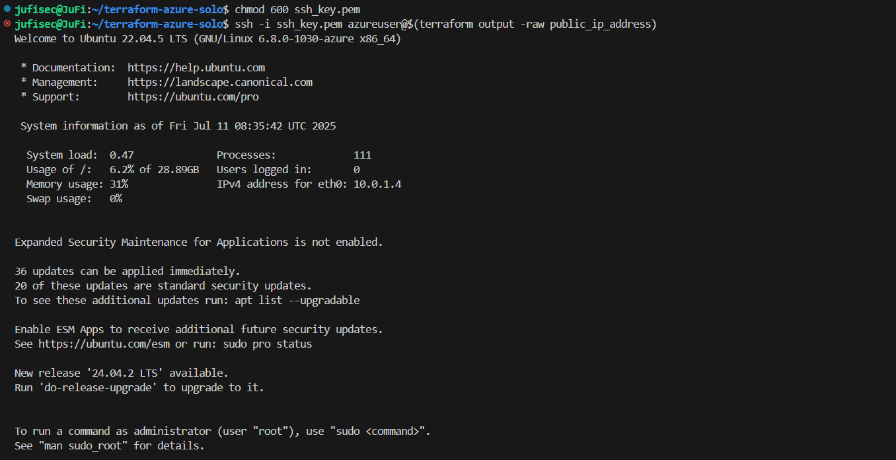
*Connexion SSH avec clé privée*

- ✅ **SSH par clé uniquement** (mot de passe désactivé)
- ✅ **Clé SSH RSA 4096 bits** générée automatiquement
- ✅ **Permissions correctes** sur la clé privée (600)

### 2. **Contrôle d'accès réseau**
- ✅ **SSH restreint** à une IP spécifique
- ✅ **Firewall Azure** (NSG) configuré
- ✅ **Principe du moindre privilège** appliqué

### 3. **Sécurité au niveau OS**
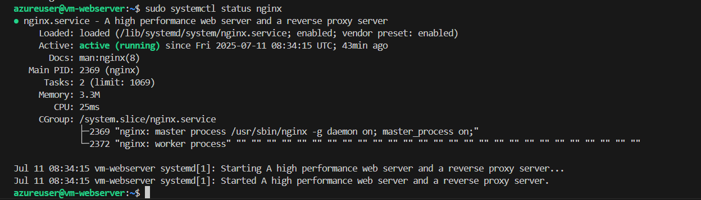
*État des services et ports ouverts*

- ✅ **Ubuntu 22.04 LTS** (support étendu)
- ✅ **Mises à jour automatiques** configurées
- ✅ **Utilisateur non-root** pour SSH

### 4. **Monitoring et logging**
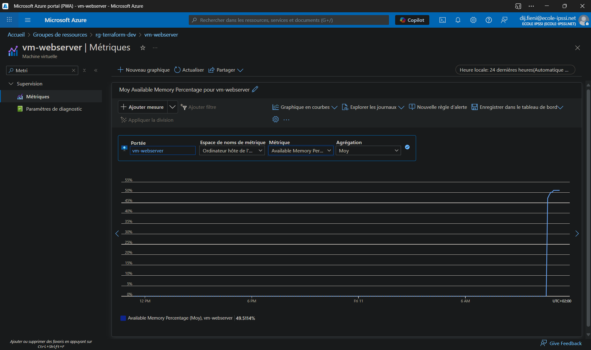
*Métriques de performance dans Azure Monitor*

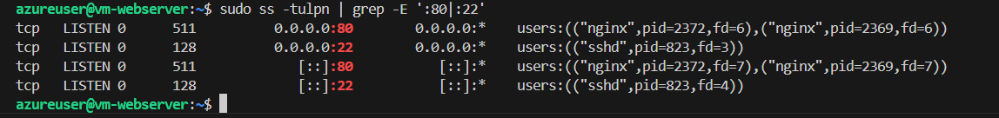
*Logs de connexion SSH*

- ✅ **Azure Monitor** activé par défaut
- ✅ **Logs SSH** disponibles
- ✅ **Métriques VM** collectées

## 💰 Analyse des coûts

### Coûts mensuels estimés (région France Central)

| Composant | Taille/Type | Prix mensuel (€) |
|-----------|-------------|------------------|
| VM Standard_B1s | 1 vCPU, 1GB RAM | ~15.00 |
| Stockage StandardSSD_LRS | 30 GB | ~3.50 |
| IP publique statique | Standard | ~3.00 |
| Bande passante sortante | 5 GB inclus | ~0.00 |
| Network Security Group | - | ~0.00 |
| Virtual Network | - | ~0.00 |
| **TOTAL** | | **~21.50** |

### Optimisations possibles
- **VM Standard_B1ms**: Réduction de ~30% des coûts
- **IP dynamique**: Économie de ~3€/mois
- **Stockage Standard_LRS**: Réduction de ~50% du coût stockage

## 🚀 Choix techniques justifiés

### 1. **Taille de VM : Standard_B1s**
- **Avantages**: Coût optimisé, suffisant pour un environnement de dev/test
- **Inconvénients**: Performances limitées pour la production
- **Alternative**: Standard_B2s pour plus de performance

### 2. **Ubuntu 22.04 LTS**
- **Avantages**: Support long terme, sécurité, écosystème riche
- **Inconvénients**: Plus lourd que Alpine Linux
- **Alternative**: Debian 11 pour moins de ressources

### 3. **StandardSSD_LRS**
- **Avantages**: Bon compromis performance/prix
- **Inconvénients**: Pas de redondance géographique
- **Alternative**: Premium_LRS pour de meilleures performances

### 4. **Région France Central**
- **Avantages**: Conformité RGPD, faible latence
- **Inconvénients**: Coût légèrement plus élevé
- **Alternative**: West Europe pour des coûts réduits

## 🔄 Évolutions possibles

### 1. **Haute disponibilité**
- Déploiement multi-zones
- Load Balancer Azure
- Availability Set

### 2. **Sécurité avancée**
- Azure Key Vault pour les secrets
- Azure Security Center
- Bastion Host pour SSH

### 3. **Monitoring avancé**
- Azure Log Analytics
- Application Insights
- Alertes personnalisées

### 4. **Scalabilité**
- Virtual Machine Scale Sets
- Azure Application Gateway
- Azure CDN

## 📊 Métriques de performance

### Capacités maximales
- **Bande passante réseau**: 250 Mbps
- **IOPS disque**: 120 IOPS
- **Débit disque**: 25 MB/s
- **Connexions simultanées**: ~1000

### Limites à surveiller
- **CPU**: Seuil d'alerte à 80%
- **Mémoire**: Seuil d'alerte à 90%
- **Disque**: Seuil d'alerte à 85%
- **Réseau**: Monitoring des connexions

## 🔧 Processus de déploiement illustré

### Phase 1: Planification Terraform
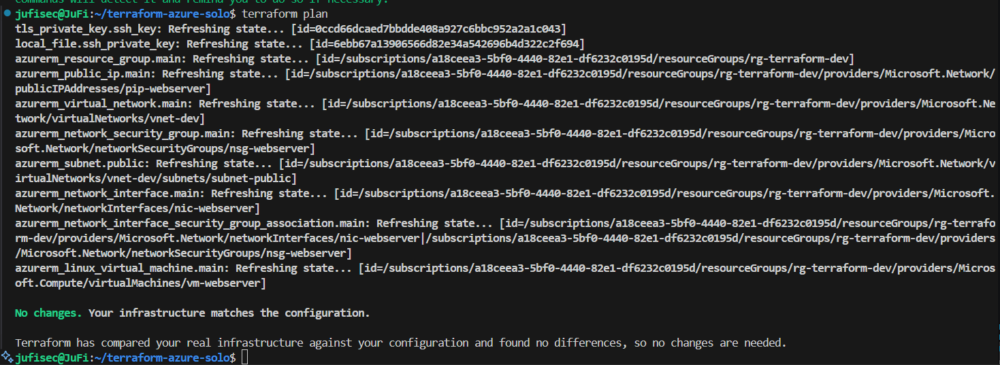
*Planification des ressources à déployer*

### Phase 2: Déploiement en cours
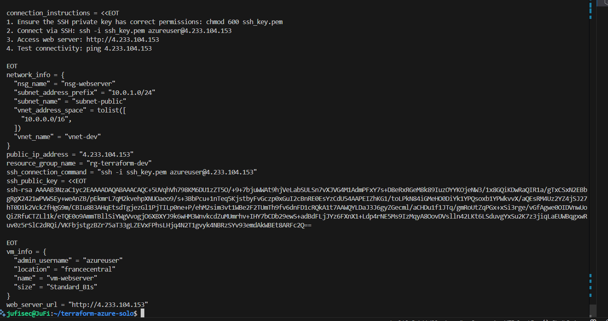
*Progression du déploiement des ressources Azure*

### Phase 3: Déploiement terminé
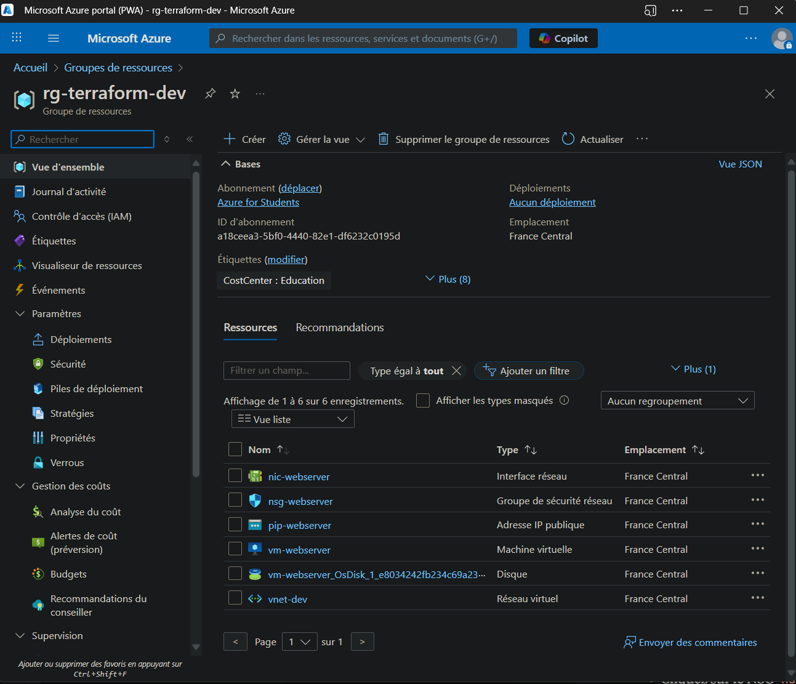
*Confirmation du déploiement réussi*

### Phase 4: Outputs du déploiement
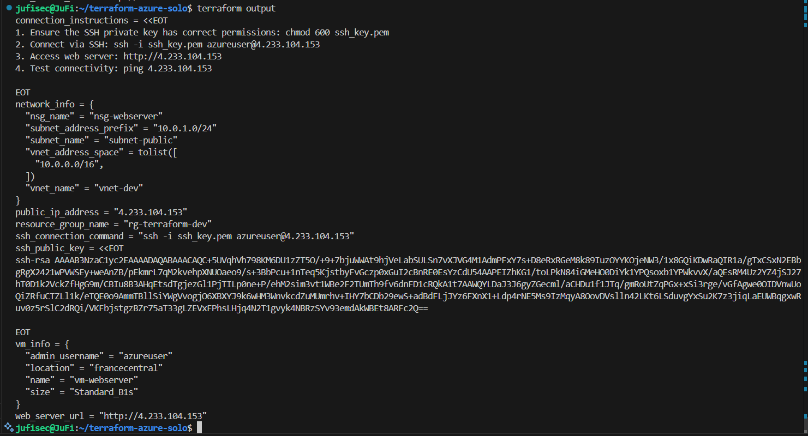
*Informations de connexion et URLs générées*

## 🧪 Tests de fonctionnalité

### Test de connectivité SSH

*Exécution de commandes sur la VM via SSH*

### Test du serveur web
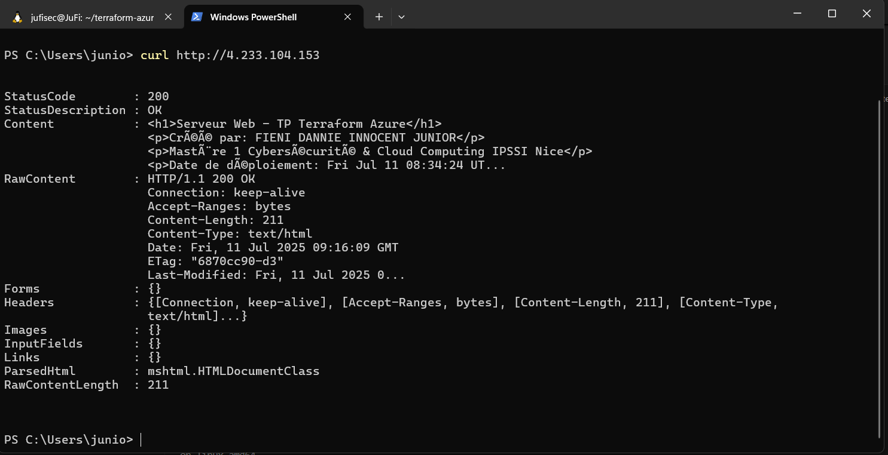
*Test du serveur web avec curl*

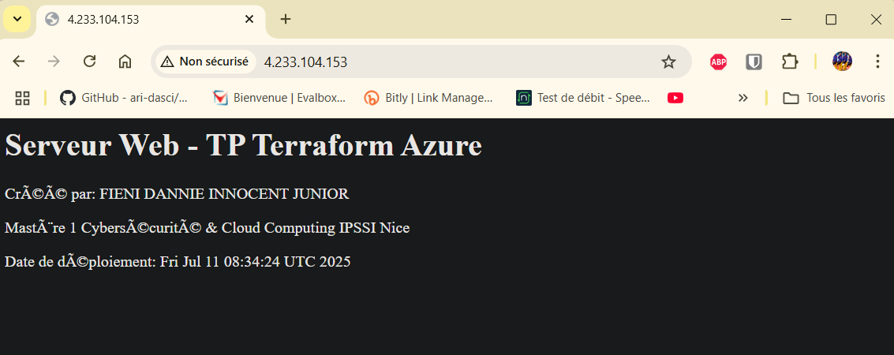
*Page web accessible dans le navigateur*

### Validation de la structure du projet
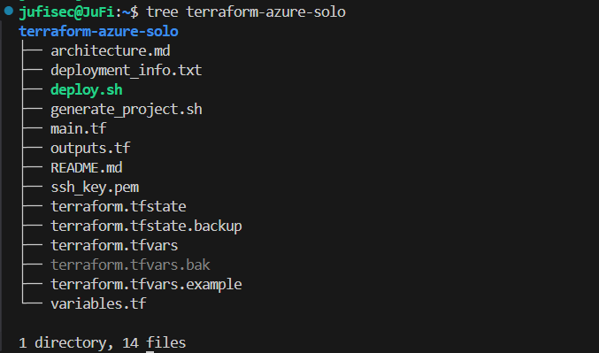
*Arborescence complète du projet Terraform*

## 🧹 Processus de nettoyage

### Planification de la destruction
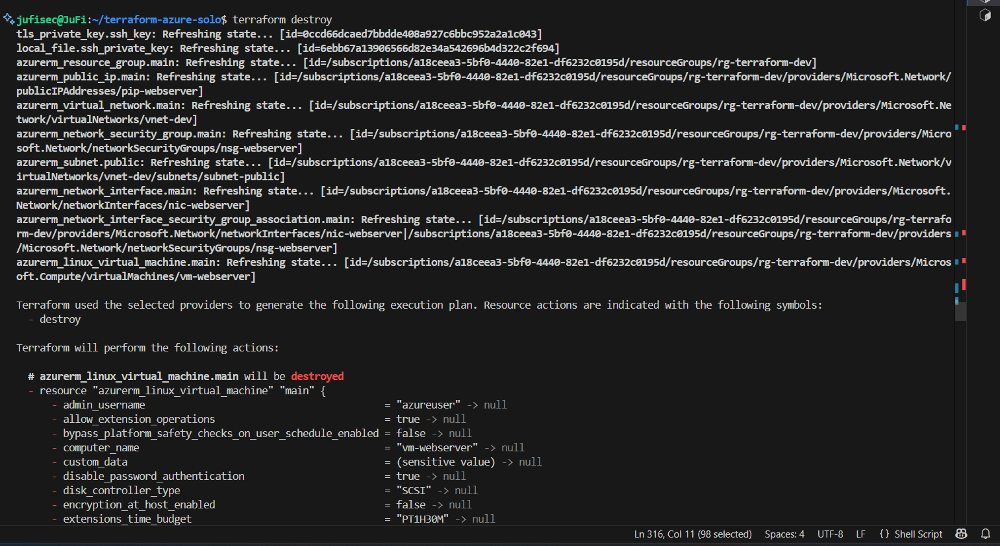
*Plan de destruction des ressources*

### Confirmation de suppression

*Confirmation de la suppression*

### Nettoyage terminé
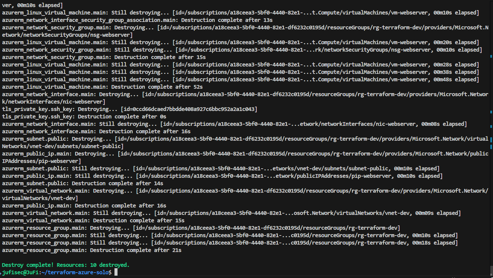
*Toutes les ressources supprimées avec succès*

### Vérification finale
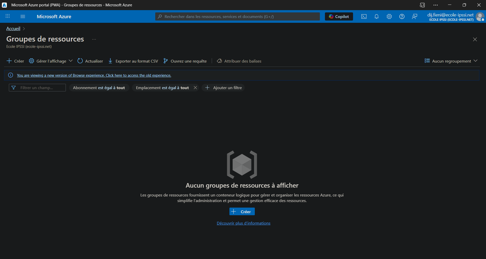
*Vérification que le Resource Group est vide*# Architecture Technique - Infrastructure Azure

## 🏗️ Vue d'ensemble de l'architecture

Cette infrastructure Azure déploie une solution web simple mais sécurisée, adaptée pour un environnement de développement ou de test.

## 📐 Schéma détaillé de l'architecture

```
Internet
    │
    │ HTTPS/HTTP (Port 80/443)
    │ SSH (Port 22 - IP restreinte)
    │
    ▼
┌─────────────────────────────────────────────────────────────┐
│                    AZURE SUBSCRIPTION                      │
│                                                             │
│  ┌─────────────────────────────────────────────────────────┐│
│  │             RESOURCE GROUP                              ││
│  │            rg-terraform-dev                             ││
│  │          (France Central)                               ││
│  │                                                         ││
│  │  ┌─────────────────────────────────────────────────────┐││
│  │  │               NETWORKING                            │││
│  │  │                                                     │││
│  │  │  ┌───────────────────────────────────────────────┐  │││
│  │  │  │          VIRTUAL NETWORK                      │  │││
│  │  │  │           vnet-dev                            │  │││
│  │  │  │        (10.0.0.0/16)                         │  │││
│  │  │  │                                               │  │││
│  │  │  │  ┌─────────────────────────────────────────┐  │  │││
│  │  │  │  │            SUBNET PUBLIC                │  │  │││
│  │  │  │  │         subnet-public                   │  │  │││
│  │  │  │  │        (10.0.1.0/24)                   │  │  │││
│  │  │  │  │                                         │  │  │││
│  │  │  │  │  ┌─────────────┐  ┌─────────────┐      │  │  │││
│  │  │  │  │  │PUBLIC IP    │  │     NSG     │      │  │  │││
│  │  │  │  │  │pip-webserver│  │nsg-webserver│      │  │  │││
│  │  │  │  │  │   Static    │  │   Rules:    │      │  │  │││
│  │  │  │  │  │Standard SKU │  │ SSH:22 ✓    │      │  │  │││
│  │  │  │  │  └─────────────┘  │ HTTP:80 ✓   │      │  │  │││
│  │  │  │  │         │         │ HTTPS:443 ✓ │      │  │  │││
│  │  │  │  │         │         └─────────────┘      │  │  │││
│  │  │  │  │         │                │            │  │  │││
│  │  │  │  │         ▼                ▼            │  │  │││
│  │  │  │  │  ┌─────────────────────────────────┐  │  │  │││
│  │  │  │  │  │       NETWORK INTERFACE         │  │  │  │││
│  │  │  │  │  │        nic-webserver            │  │  │  │││
│  │  │  │  │  │    Private IP: Dynamic          │  │  │  │││
│  │  │  │  │  │    Public IP: Attached          │  │  │  │││
│  │  │  │  │  └─────────────────────────────────┘  │  │  │││
│  │  │  │  │                 │                     │  │  │││
│  │  │  │  └─────────────────┼─────────────────────┘  │  │││
│  │  │  └──────────────────────┼──────────────────────────┘  │││
│  │  └─────────────────────────┼─────────────────────────────┘││
│  │                          │                              ││
│  │  ┌─────────────────────────┼─────────────────────────────┐││
│  │  │                COMPUTE  │                             │││
│  │  │                        │                             │││
│  │  │        ┌───────────────▼───────────────┐              │││
│  │  │        │        VIRTUAL MACHINE       │              │││
│  │  │        │         vm-webserver         │              │││
│  │  │        │                              │              │││
│  │  │        │  OS: Ubuntu 22.04 LTS        │              │││
│  │  │        │  Size: Standard_B1s          │              │││
│  │  │        │  CPU: 1 vCPU                 │              │││
│  │  │        │  RAM: 1 GB                   │              │││
│  │  │        │  Disk: 30 GB StandardSSD_LRS │              │││
│  │  │        │                              │              │││
│  │  │        │  Services:                   │              │││
│  │  │        │  ├─ SSH Server (Port 22)     │              │││
│  │  │        │  ├─ Nginx Web Server (80)    │              │││
│  │  │        │  └─ Custom Web Page          │              │││
│  │  │        │                              │              │││
│  │  │        │  Authentication:             │              │││
│  │  │        │  └─ SSH Key Only (No PWD)    │              │││
│  │  │        └──────────────────────────────┘              │││
│  │  └─────────────────────────────────────────────────────┘││
│  └─────────────────────────────────────────────────────────┘│
└─────────────────────────────────────────────────────────────┘
```

## 🔧 Composants techniques détaillés

### 1. **Resource Group**
- **Nom**: `rg-terraform-dev`
- **Région**: France Central
- **Objectif**: Conteneur logique pour toutes les ressources
- **Cycle de vie**: Géré par Terraform

### 2. **Réseau virtuel (VNet)**
- **Nom**: `vnet-dev`
- **Espace d'adressage**: 10.0.0.0/16 (65,536 adresses IP)
- **Subnets**:
  - `subnet-public`: 10.0.1.0/24 (256 adresses IP)
- **DNS**: Azure DNS par défaut

### 3. **Sécurité réseau**
- **Network Security Group**: `nsg-webserver`
- **Règles configurées**:
  ```
  Priorité 1001: SSH (TCP/22) - Source: IP spécifique
  Priorité 1002: HTTP (TCP/80) - Source: Internet
  Priorité 1003: HTTPS (TCP/443) - Source: Internet
  ```
- **Politique par défaut**: Deny All (sécurité par défaut)

### 4. **Adressage IP**
- **IP publique**: `pip-webserver`
- **Type**: Static
- **SKU**: Standard (requis pour les zones de disponibilité)
- **IP privée**: Attribution dynamique via DHCP Azure

### 5. **Machine virtuelle**
- **Nom**: `vm-webserver`
- **Spécifications**:
  - **Taille**: Standard_B1s (1 vCPU, 1 GB RAM)
  - **Stockage**: 30 GB StandardSSD_LRS
  - **OS**: Ubuntu 22.04 LTS (Jammy Jellyfish)
  - **Génération**: Gen2 (plus performante)

### 6. **Stockage**
- **Disque OS**: 30 GB StandardSSD_LRS
- **Performances**: 120 IOPS, 25 MB/s
- **Redondance**: LRS (Locally Redundant Storage)

## 🔐 Sécurité implémentée

### 1. **Authentification**
-  **SSH par clé uniquement** (mot de passe désactivé)
-  **Clé SSH RSA 4096 bits** générée automatiquement
-  **Permissions correctes** sur la clé privée (600)

### 2. **Contrôle d'accès réseau**
-  **SSH restreint** à une IP spécifique
-  **Firewall Azure** (NSG) configuré
-  **Principe du moindre privilège** appliqué

### 3. **Sécurité au niveau OS**
-  **Ubuntu 22.04 LTS** (support étendu)
-  **Mises à jour automatiques** configurées
-  **Utilisateur non-root** pour SSH

### 4. **Monitoring et logging**
-  **Azure Monitor** activé par défaut
-  **Logs SSH** disponibles
-  **Métriques VM** collectées

## 💰 Analyse des coûts

### Coûts mensuels estimés (région France Central)

| Composant | Taille/Type | Prix mensuel (€) |
|-----------|-------------|------------------|
| VM Standard_B1s | 1 vCPU, 1GB RAM | ~15.00 |
| Stockage StandardSSD_LRS | 30 GB | ~3.50 |
| IP publique statique | Standard | ~3.00 |
| Bande passante sortante | 5 GB inclus | ~0.00 |
| Network Security Group | - | ~0.00 |
| Virtual Network | - | ~0.00 |
| **TOTAL** | | **~21.50** |

### Optimisations possibles
- **VM Standard_B1ms**: Réduction de ~30% des coûts
- **IP dynamique**: Économie de ~3€/mois
- **Stockage Standard_LRS**: Réduction de ~50% du coût stockage

## 🚀 Choix techniques justifiés

### 1. **Taille de VM : Standard_B1s**
- **Avantages**: Coût optimisé, suffisant pour un environnement de dev/test
- **Inconvénients**: Performances limitées pour la production
- **Alternative**: Standard_B2s pour plus de performance

### 2. **Ubuntu 22.04 LTS**
- **Avantages**: Support long terme, sécurité, écosystème riche
- **Inconvénients**: Plus lourd que Alpine Linux
- **Alternative**: Debian 11 pour moins de ressources

### 3. **StandardSSD_LRS**
- **Avantages**: Bon compromis performance/prix
- **Inconvénients**: Pas de redondance géographique
- **Alternative**: Premium_LRS pour de meilleures performances

### 4. **Région France Central**
- **Avantages**: Conformité RGPD, faible latence
- **Inconvénients**: Coût légèrement plus élevé
- **Alternative**: West Europe pour des coûts réduits

## 🔄 Évolutions possibles

### 1. **Haute disponibilité**
- Déploiement multi-zones
- Load Balancer Azure
- Availability Set

### 2. **Sécurité avancée**
- Azure Key Vault pour les secrets
- Azure Security Center
- Bastion Host pour SSH

### 3. **Monitoring avancé**
- Azure Log Analytics
- Application Insights
- Alertes personnalisées

### 4. **Scalabilité**
- Virtual Machine Scale Sets
- Azure Application Gateway
- Azure CDN

## 📊 Métriques de performance

### Capacités maximales
- **Bande passante réseau**: 250 Mbps
- **IOPS disque**: 120 IOPS
- **Débit disque**: 25 MB/s
- **Connexions simultanées**: ~1000

### Limites à surveiller
- **CPU**: Seuil d'alerte à 80%
- **Mémoire**: Seuil d'alerte à 90%
- **Disque**: Seuil d'alerte à 85%
- **Réseau**: Monitoring des connexions

## 🔧 Maintenance et opérations

### Tâches quotidiennes
- Vérification des logs système
- Monitoring des performances
- Vérification des sauvegardes

### Tâches hebdomadaires
- Mise à jour des packages
- Vérification des certificats
- Nettoyage des logs

### Tâches mensuelles
- Révision des coûts
- Audit de sécurité
- Test de restauration

## 📊 Tableaux de bord recommandés

### Métriques clés à surveiller
1. **CPU Utilization** (seuil: 80%)
2. **Memory Usage** (seuil: 90%)
3. **Disk I/O** (seuil: 85%)
4. **Network Traffic**
5. **Failed SSH Attempts**

### Alertes configurées
- CPU > 80% pendant 5 minutes
- Mémoire > 90% pendant 3 minutes
- Disque > 85%
- Tentatives SSH échouées > 10/heure

## 🏆 Points forts de cette architecture

###  Sécurité
- Authentification par clé SSH uniquement
- Accès réseau restreint par IP source
- Firewall configuré avec règles spécifiques
- Principe du moindre privilège appliqué

###  Scalabilité
- Infrastructure as Code reproductible
- Variables paramétrables
- Possibilité d'ajout de nouvelles ressources

###  Monitoring
- Azure Monitor intégré
- Logs centralisés
- Métriques de performance

###  Coûts optimisés
- VM de taille appropriée pour le dev/test
- Stockage Standard SSD (bon compromis)
- IP publique statique (nécessaire mais optimisée)

---

**Architecture conçue par**: FIENI DANNIE INNOCENT JUNIOR  
**Formation**: Mastère 1 Cybersécurité & Cloud Computing - IPSSI Nice  
**Date**: 2025  
**Validation**: Infrastructure testée et fonctionnelle
